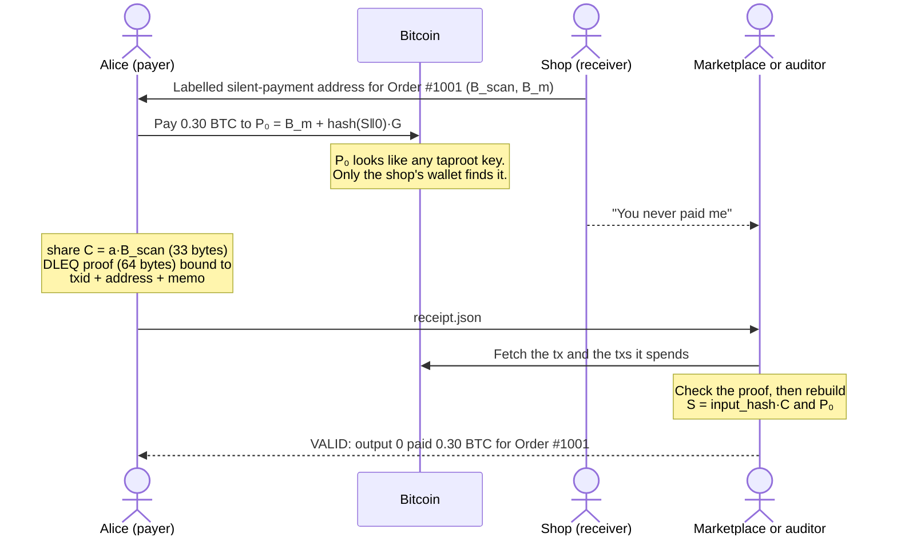
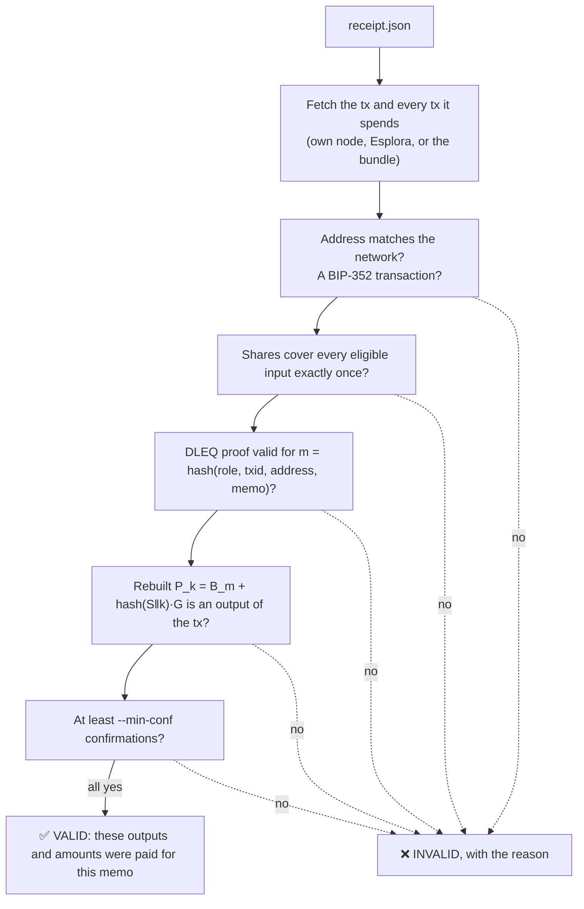
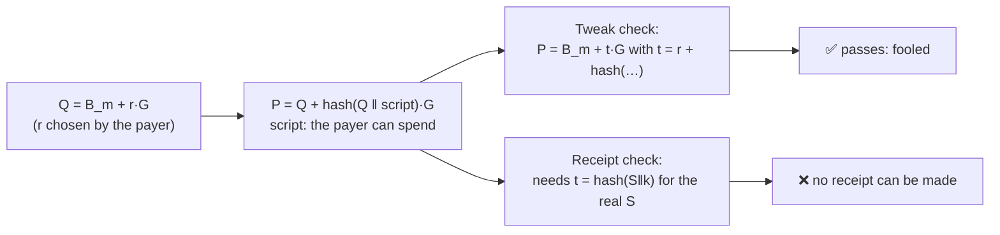

# Silent Payment Receipts

Prove that you paid a Bitcoin silent-payment address.

A silent payment (BIP-352) lands in a random-looking output that only the receiver can
recognise. Good for privacy, but it means the sender cannot show anyone else that the
payment happened. This project adds a **receipt**: a small proof that a confirmed
transaction paid a given silent-payment address, tied to one order. The shop, a
marketplace, an auditor or a court can check it against the blockchain. No private
keys are shared, and the receiver does not have to cooperate.

> **Prototype.** Pure-Python cryptography, not constant time. Do not use it with real money.

<p align="center">
  
</p>

## Why it's useful

Silent payments hide who was paid. That is good for privacy, but it also means the
payer has nothing to point to when something goes wrong. Today the only option is to
share the output tweak, and that check can be faked (see
[below](#why-not-just-share-the-tweak)). A receipt fills the gap:

* **Settles disputes.** A third party can check "you never paid me" against the chain.
* **Proves one payment, not the whole wallet.** An auditor sees the payment they asked
  about and nothing else.
* **Needs nothing from the receiver,** and no private keys are shared.
* **Cannot be reused.** It is tied to one transaction, one address and one memo
  (an order or invoice id).
* **Small and checkable by anyone** with a Bitcoin node or block explorer: a 33-byte
  share and a 64-byte proof per payer.

Two examples:

* **"You never paid me."** Alice pays a shop 0.30 BTC for Order #1001. The shop says the
  money never came. Alice sends a receipt to the marketplace, which checks it and sees
  the payment went to the shop's address.
* **Year-end audit.** A company proves one 0.5 BTC payment to a supplier. The auditor
  checks that receipt; the rest of the wallet stays private.

The receiver can also prove the other way round: "this output is my income".

## Try it

Python 3.10+ and no packages to install.

```sh
python3 -m unittest discover -s tests -t .      # 36 tests: BIP-352 + BIP-374 vectors, attacks, web demo (~20 s)
SPRECEIPT_SLOW=1 python3 -m unittest tests.test_bip352_vectors   # adds the 2,323-output K_max case (~3 min)

BITCOIND=/path/to/bitcoind python3 demo/regtest_demo.py   # full story on a private regtest chain
```

The demo starts a throwaway regtest node, pays a shop with a real silent payment, makes
and checks a receipt, and shows two cheats failing. [demo/samples/](demo/samples/) has
the receipts it produced.

### In the browser

[web/](web/) is a page where you play the whole story: the shop sends an invoice, you pay
it, you make a receipt, a marketplace checks it, and you try to cheat. It runs this
project's Python code in the browser with [Pyodide](https://pyodide.org), on a small
simulated chain ([webdemo/](webdemo/)). The transactions are real and signed (Bitcoin Core
accepts the same signing code) and the receipts are the real ones; only the network and
mining are simulated. Needs Node 20.19+ or 22.12+.

```sh
cd web && npm install && npm run dev      # then open the printed localhost URL
npm run build                             # static site in web/dist/
```

Add `?autoplay` to the URL to play the story without clicking.

## Commands

```sh
# Receiver: keys and one labelled address per invoice
python3 -m spreceipt keygen --network regtest --label 1001

# Sender: make a receipt after paying (keys of the inputs you spent)
python3 -m spreceipt make --txid <txid> --address <tsp1...> --key-file my-input-keys.txt \
    --memo "Order #1001" --network regtest --rpc http://127.0.0.1:18443 --rpc-cookie <.cookie> -o receipt.json

# Anyone: check it against your own node (or --esplora URL, or --offline for math only)
python3 -m spreceipt verify receipt.json --rpc http://127.0.0.1:18443 --rpc-cookie <.cookie>

# Receiver: prove an output is yours
python3 -m spreceipt prove --txid <txid> --scan-key <hex> --spend-key <hex> --label 1001 \
    --memo "Income statement 2026" --network regtest --rpc ... -o proof.json

# Several payers in one transaction (coinjoin, payjoin): merge their partial receipts
python3 -m spreceipt combine alice.json bob.json -o receipt.json
```

## How it works

When Alice pays, her wallet computes a shared secret with the shop's scan key. The
receipt contains:

1. **The share**: `a * B_scan`, where `a` is the sum of Alice's input keys (33 bytes).
2. **A BIP-374 DLEQ proof** (64 bytes) that the share was made with the same keys that
   signed the transaction's inputs. Its optional message field is filled with the
   txid, the address and a hash of the memo, so the receipt cannot be moved to another
   order or transaction.

The checker rebuilds everything else from the blockchain: the input keys, the
shared secret, and the output address `P_k = B_m + hash(S || k)*G`. If that output is
in the transaction, the payment is proven.

### Who does what



### What `verify` checks

The receipt only supplies the claim (txid, address, memo), the shares and the proofs.
Everything else comes from the transactions the verifier fetches itself
([spreceipt/verify.py](spreceipt/verify.py)).



A receiver proof adds one more check: each paid output needs a signature by its own
output key, so a scanning server that only holds the scan key cannot fake one. With
`--offline` the confirmation check is skipped and the result carries a warning.

### Why not just share the tweak?

A check of `P = B_m + t*G` can be faked: the sender can hide a taproot script path that
lets them take the money back. The demo shows this fake passing the tweak check, and no
receipt can be made for it.



## What is new, and what is not

The cryptography is not new. BIP-375 already carries the same share and DLEQ proof in
PSBTs, but only so co-signers can check each other while building a transaction; the
proof is thrown away afterwards. This project adds:

* **A new use:** a receipt kept and shown to outsiders after confirmation.
* **The unused option:** BIP-374's optional message, which BIP-375 leaves empty, binds
  the proof to one order.
* **Checking rules** against the confirmed chain, and a **receiver-side proof** with an
  output-key signature.
* A **format** and tests, so wallets can interoperate.

The same idea exists on other chains: Monero tx proofs and Zcash payment
disclosures (ZIP-311). The full rules are in [SPEC.md](SPEC.md).

## Things to know

* **Share receipts only with the person who needs them.** A receipt reveals your shared
  secret with that receiver, which can expose other payments from the same keys.
* **Use one labelled address per order.** Otherwise one payment could be claimed against
  two invoices.
* **Only trust confirmed transactions.** `verify --offline` checks the math but not
  confirmations.
* Passing keys with `--key` or `--scan-key` puts them in your shell history; prefer
  `--key-file`.

## Layout

| Path | What |
| --- | --- |
| `spreceipt/receipt.py` | Receipt format and the signed message |
| `spreceipt/prove.py` | Making sender receipts and receiver proofs |
| `spreceipt/verify.py` | Checking a receipt |
| `spreceipt/bip352.py` | The BIP-352 rules receipts need (addresses, inputs, outputs, scanning) |
| `spreceipt/crypto.py` | BIP-374 DLEQ proofs and curve helpers |
| `spreceipt/sources.py` | Bitcoin Core RPC, Esplora and bundled transactions |
| `spreceipt/cli.py` | The `spreceipt` command |
| `tests/` | BIP-352 and BIP-374 test vectors, attack tests |
| `demo/regtest_demo.py` | End-to-end demo with Bitcoin Core |
| `webdemo/` | Simulated chain and the shop / payer / verifier story for the browser demo |
| `web/` | The browser demo (TypeScript + Vite, Python via Pyodide) |
| `docs/how-it-works.svg` | The animated diagram at the top of this page |

Vendored code and licences: [THIRD_PARTY.md](THIRD_PARTY.md).
